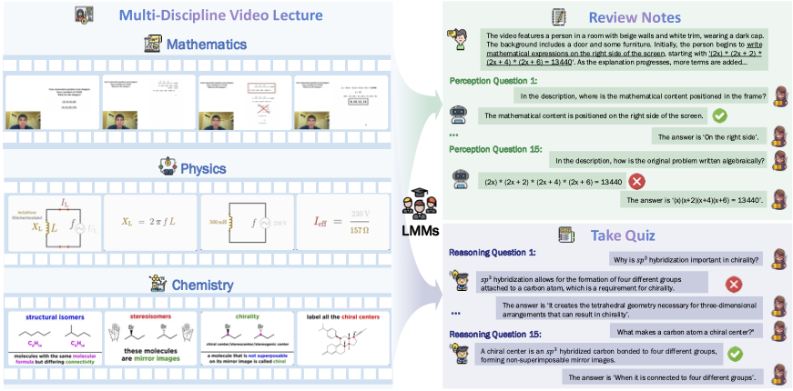

# Video-MMLU

<table><tr><td>
    <strong>Video-MMLU</strong>: A Massive Multi-Discipline Lecture Understanding Benchmark.
</td></tr>
</table>

**TODO**
## To-Do List

- [x] Release Arxiv version
- [x] Upload source video, detailed captions and QA pairs
- [x] Upload lmms-eval code
- [x] Upload VLMEvalkit code
- [ ] Upload figures_in_paper
- [ ] Upload the frame captions, video captions and the transcripts
- [ ] Upload keyframes

