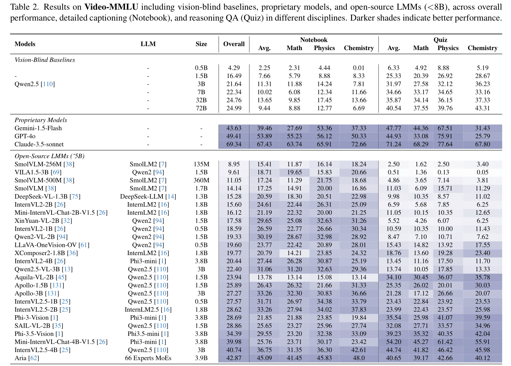
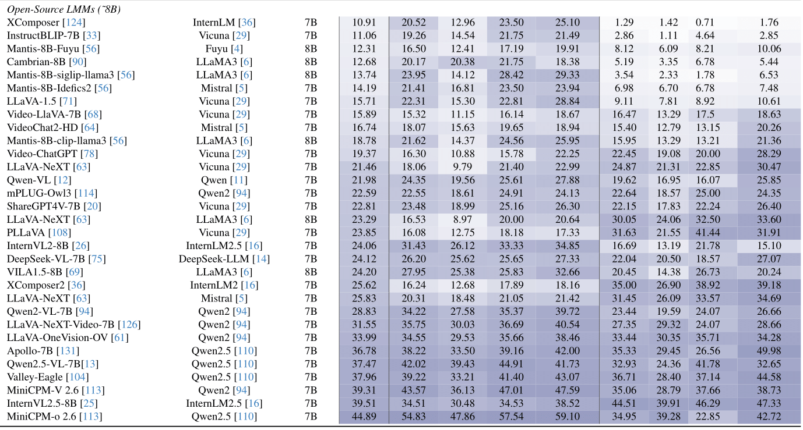
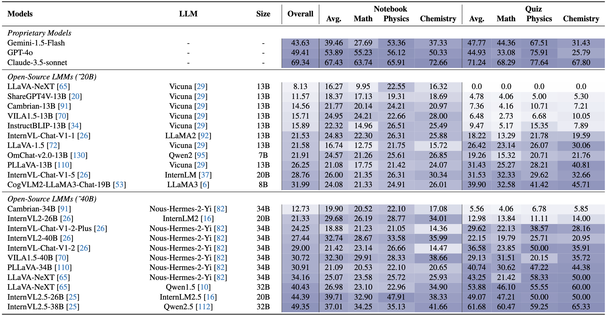

# Video-MMLU

<table><tr><td>
    <strong>Video-MMLU</strong>: A Massive Multi-Discipline Lecture Understanding Benchmark.
</td></tr>
</table>

Video-MMLU specifically targets videos that focus on theorem demonstrations and probleming-solving, covering mathematics, physics, and chemistry. The videos deliver dense information through numbers and formulas, pose significant challenges for video LMMs in dynamic OCR recognition and comprehension.

Imagine a classroom where a large multimodal model is the **student** and Video-MMLUacts as the **teacher**.Video-MMLU evaluates whether the student can perceive and comprehend multi-discipline lectures, much like a student taking notes and being tested later. For each video, we generate a detailed caption as the standard **"notes"** to assess the model’s visual perception. Additionally, we create 15 questions as a **"quiz"** to evaluate content reasoning, challenging the model’s ability to apply learned knowledge.

## News

- [2025/3/27] Release Video-MMLU benchmark, as well as the evaluation code on [lmms-eval](https://github.com/EvolvingLMMs-Lab/lmms-eval) and [VLMEvalkit](https://github.com/open-compass/VLMEvalKit).

## Evaluation Pipeline

We evaluate the Video-MMLU benchmark on two open-source multimodal large model evaluation frameworks, [lmms-eval](https://github.com/EvolvingLMMs-Lab/lmms-eval) and [VLMEvalkit](https://github.com/open-compass/VLMEvalKit). We use Qwen2.5-72B-Instruct as the judge model. Since loading the judge model will occupy memory and cause waste, we provide two ways to evaluate, including using SiliconFlowAPI (only support by VLMEvalkit) and local load Qwen2.5-72B for post-processing.

For more detailed, please refer to [Eval Docs](https://github.com/Espere-1119-Song/Video-MMLU/blob/main/EVAL.md).

## Leaderboard
We evaluate a total of 96 models across three categories:
 - **3 Proprietary Models**, including Gemini-1.5-Flash, GPT-4o, and Claude-3.5-sonnet,
 - **78 Open-Source LMMs**, encompassing state-of-the-art video-specific LMMs and image-based LMMs capable of processing multiple images, with model sizes **ranging from 256M to 40B**,
 - **9 token compression models**, especially for visual token reduction,
 - **6 Vision-Blind Baselines**.
 

To submit your model results, please send an email with your logs to enxin.23@intl.zju.edu.cn or open an issue in our repository.

## To-Do List

- [x] Release Arxiv version
- [x] Upload source video, detailed captions and QA pairs
- [x] Upload lmms-eval code
- [x] Upload VLMEvalkit code
- [ ] Upload figures_in_paper
- [ ] Upload the frame captions, video captions and the transcripts
- [ ] Upload keyframes

